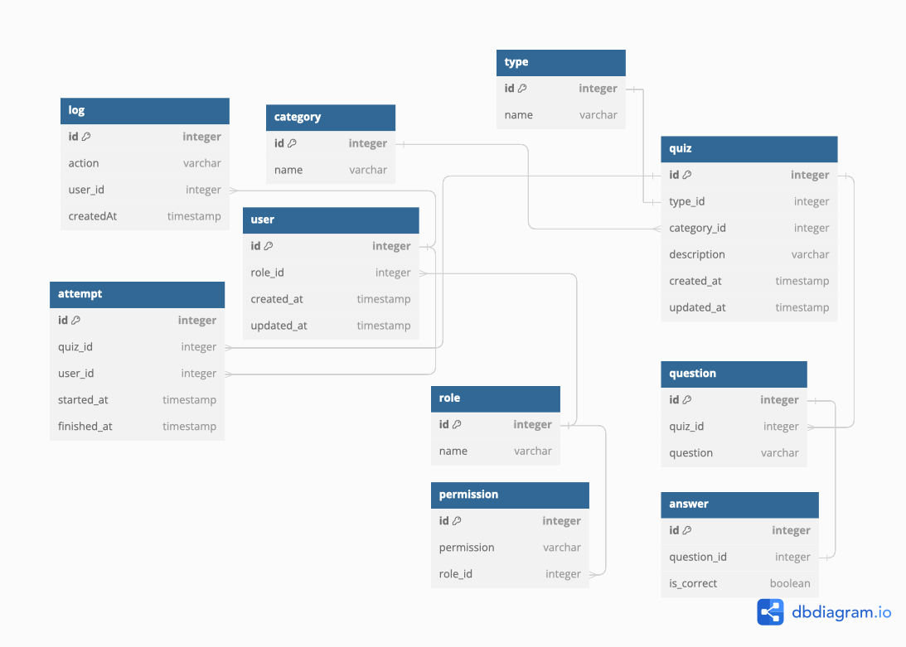

# Quizconst 🔷

## Description

Quizconst is a simple quiz app that allows users to create and take quizzes. Users can create quizzes by adding questions and answers. Users can also take quizzes and view their scores.

## ToDos left

User stories:

- [x] user profile
  - [x] user info
  - [x] avatar
  - [x] stats
  - [ ] export score to file (my profile)
  - [x] edit user info (my profile)
- [x] user can add own avatar
- [ ] new attempt mode - test
- [x] admin panel
- [ ] main page with quizzes from all users
- [ ] filter quizzes by category
- [ ] quiz search
- [ ] add email property + verification

Technical:

- [ ] add logs to database
- [ ] check for vulnerabilities
- [ ] add new database schema to project README
- [ ] add some starting data to database
- [ ] input validations and error handling:
  - [x] user registration
  - [ ] profile edit
- [ ] deploy docker containers to Microsoft Azure

## University project

This project was created as part of the university course.

### Acceptance Criteria

- users
  - can create quiz by quiz wizard
  - can take quiz
  - can view quiz results
  - can view each other scores and profiles
  - can view their own scores and profile
  - user profile
    - user info
    - avatar
    - effectivness
    - number of quizzes taken
    - number of quizzes created
    - export scores to file
- quizes
  - grouped by categoriess
  - should have dedicated page with quiz info
    - quiz name
    - quiz description
    - quiz category
    - quiz questions
- database
  - users
  - quizzes
  - logs

### Database schema - draft - outdated

## Technology stack and libaries

- HTML
- CSS powerered by TailwindCSS
- JavaScript
- PHP
- MySQL
