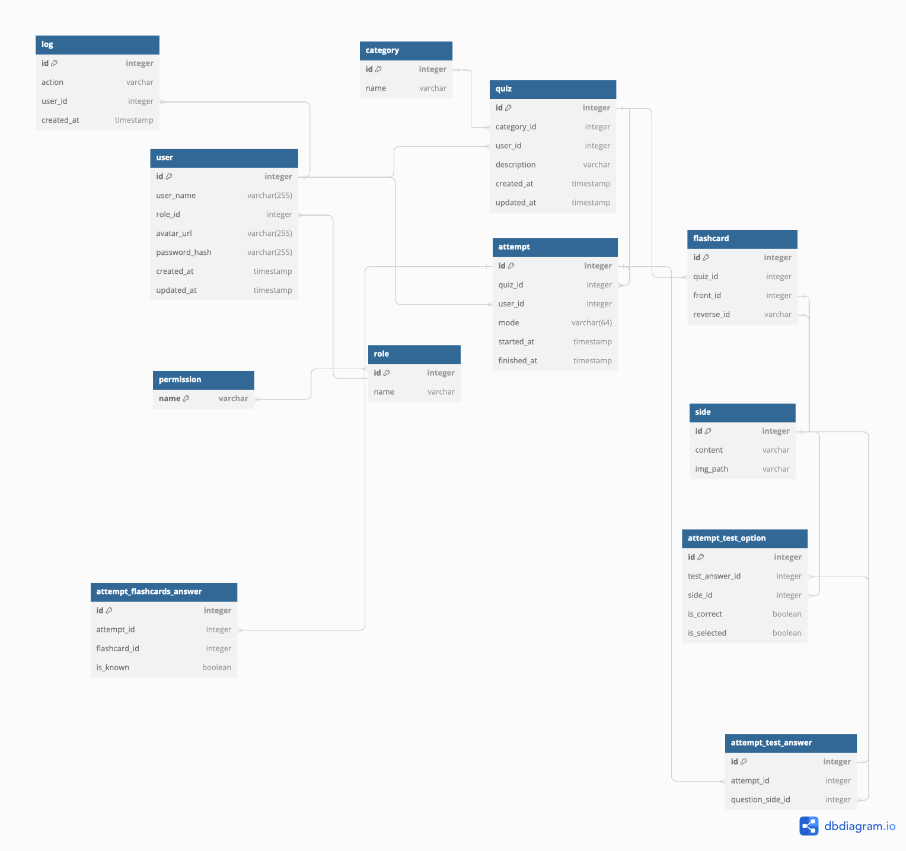

# Quizconst 🔷

## Description

Quizconst is a simple quiz app that allows users to create and take quizzes. Users can create quizzes by adding questions and answers. Users can also take quizzes and view their scores.

## University project

This project was created as part of the university course.

### Acceptance Criteria

- users
  - can create quiz by quiz wizard
  - can take quiz
  - can view quiz results
  - can view each other scores and profiles
  - can view their own scores and profile
  - user profile
    - user info
    - avatar
    - effectivness
    - number of quizzes taken
    - number of quizzes created
    - export scores to file
- quizes
  - grouped by categoriess
  - should have dedicated page with quiz info
    - quiz name
    - quiz description
    - quiz category
    - quiz questions
- database
  - users
  - quizzes
  - logs

### Database schema - draft

## Technology stack and libaries

- HTML
- CSS powerered by TailwindCSS
- JavaScript
- PHP
- MySQL
